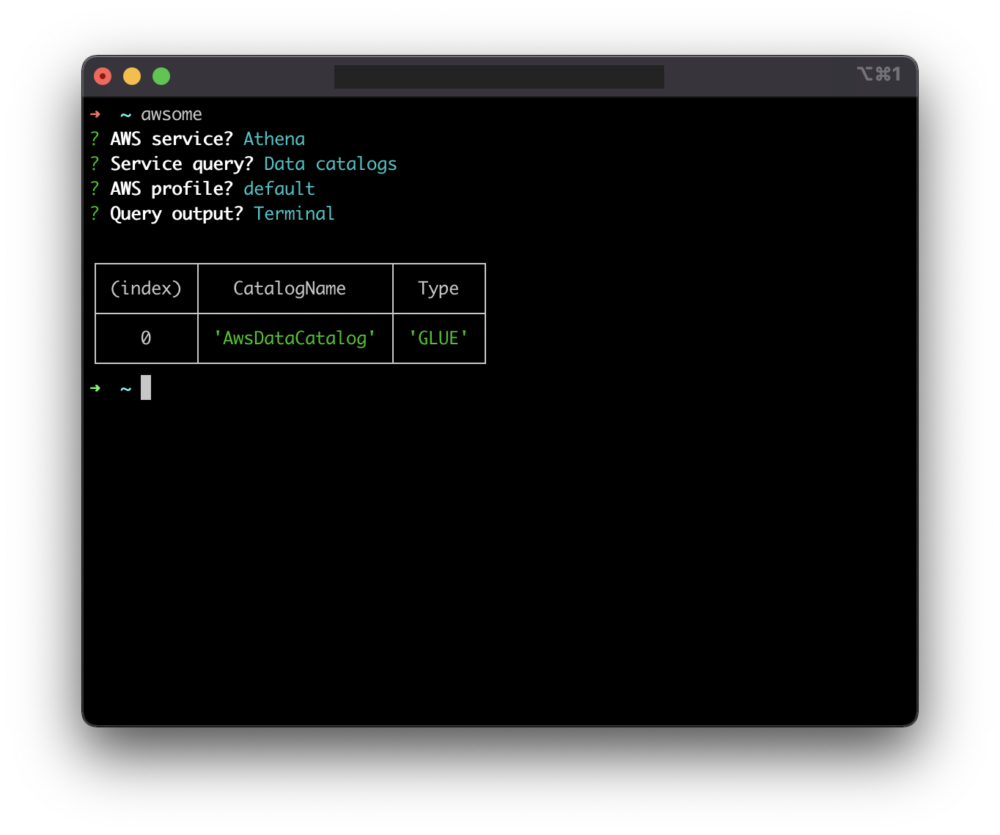

# AWSOME-CLI
Query your AWS services easily.

**awsome-cli** is a Node.js based CLI tool, which simplifies the use of AWS CLI to get information from the services you use in your AWS account(s).

## Prerequisites
* [AWS CLI](https://aws.amazon.com/cli/)
* [Node.js](https://nodejs.org/en/)

## Installation
`npm install -g @nire0510/awsome-cli`

## Usage
Simply run `awsome` command in your terminal:
> `$ awsome`

## Example

## Updates
Although **awsome-cli** automatically fetches new queries from its [Github repository](https://github.com/nire0510/awsome-cli), I strongly recommend that you update its version from time to time by running the installation script once again.
